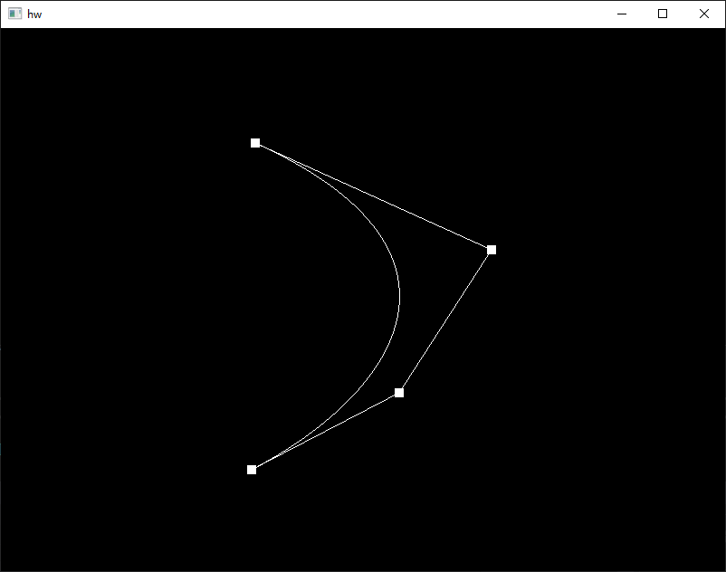
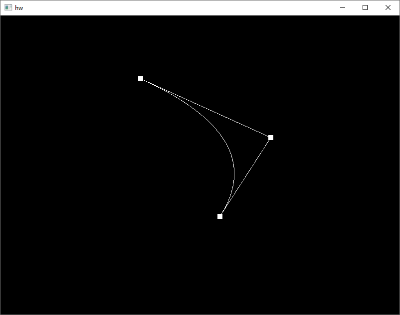
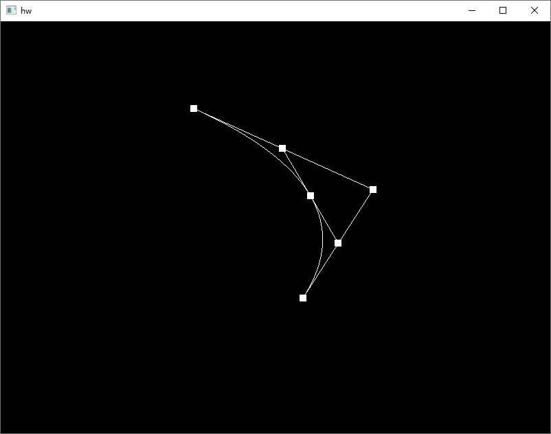

# HW8

*16340076 胡嘉鹏*

## Basic





使用`glfwSetMouseButtonCallback`设置回调函数来监听鼠标点击事件，左键点击则添加一个坐标为当前鼠标位置的点，右键点击移除最后一个点。

```c++
void mouse_button_callback(GLFWwindow * window, int button, int action, int mods)
{
	if (button == GLFW_MOUSE_BUTTON_LEFT && action == GLFW_PRESS) 	  {
		float x = (mousePosX - WIDTH / 2) * 2 / WIDTH;
		float y = -(mousePosY - HEIGHT / 2) * 2 / HEIGHT;
		hw8.addPoint(x, y);
	}
	if (button == GLFW_MOUSE_BUTTON_RIGHT && action == GLFW_PRESS) 	   {
		hw8.removeLastPoint();
	}
}
//使用vector来保存节点，是因为c++标准保证了vector的数据在内存中是连续存放的
struct pos {
	float x;
	float y;
	pos(float x, float y):x(x), y(y){}
};
vector<pos> points;
```

Bezier曲线是通过对调和函数
$$
Q(t) = \sum_{i=0}^nP_iB_{i,n}(t), t \in [0, 1]
$$
取多个$t$值，并将得到的点存储下来，最终使用`glDrawArrays(GL_LINE_STRIP,...)`绘制成一条曲线。

```c++
// t在[0, 1]上均匀地取51个点，并将调和函数的值保存在bezierPoints中
inline void HW8::calculateBezierPoint()
{
	bezierPoints.clear();
	const int num = 50;
	float detaT = float(1) / 50;
	float t = 0;
	for (int i = 0; i <= num; i++, t+= detaT)
	{
		bezierPoints.push_back(QFunc(t));
	}
}

inline pos HW8::QFunc(const float t) const
{
	pos result(0.0f, 0.0f);
	int n = points.size() - 1;
	for (int i = 0; i <= n; i++) {
		result = result + points[i] * BFunc(i, n, t);
	}
	return result;
}

inline float HW8::BFunc(const int i, const int n, const float t) const
{
	int sum1 = 1, sum2 = 1;
	for (int j = 0; j < i; j++) {
		sum1 *= (n - j);
	}
	for (int j = 1; j <= i; j++) {
		sum2 *= j;
	}
	return (float)sum1 / sum2 * pow(t, i) * pow(1 - t, n - i);
}
```

## Bonus

*按下空格开始 bonus*



Bonus的实现是实时地根据当前时间取t值，并将该t值在边上对应的点存储并显示。

```c++
inline void HW8::renderBezierState(const double now)
{
	double duration = 20.0f;
	float t = (now - startTime) / duration;
	if (t > 1.0f || points.size() < 2) {
		bonusEnable = false;
		return;
	}

	bonusPoints = points;
	int start = 0;
	const int size = points.size();
	const int totalSize = (size + 1) * size / 2;
	bonusPoints.reserve(totalSize);

	for (int s = size; s >= 2; s--) {
		for (int j = 0; j < s - 1; j++) {
			pos temp = (bonusPoints[start + j + 1] - bonusPoints[start + j]) * t + bonusPoints[start + j];
			bonusPoints.push_back(temp);
		}
		start += s;
	}

	shader->use();

	glBindVertexArray(VAO_BONUS);
	glBindBuffer(GL_ARRAY_BUFFER, VBO_BONUS);
	glBufferData(GL_ARRAY_BUFFER, (totalSize - size) * sizeof(pos), &bonusPoints[size], GL_STATIC_DRAW);
	glVertexAttribPointer(0, 2, GL_FLOAT, GL_FALSE, 2 * sizeof(float), (void*)0);
	glEnableVertexAttribArray(0);
	
	int pos = 0;
	for (int s = size - 1; s >= 1; s--)
	{
		glDrawArrays(GL_POINTS, pos, s);
		glDrawArrays(GL_LINE_STRIP, pos, s);
		pos += s;
	}
}
```

